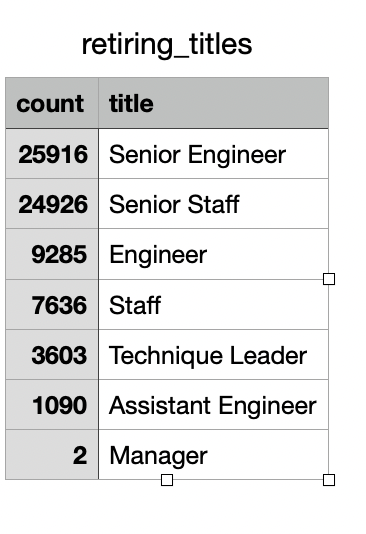

# Hewlett-Packard-Analysis

## Overview of the analysis
       
The purpose of this analysis is to determine the number of retiring employees per title, and identify employees who are eligible to participate in a mentorship program.

## Results:
   *  In Total  72458 postions will be impacted due to the "silver tsunami".

  
     
   *  Top 3 positions i.e. **Senior Engineer**, **Senior Staff** and **Engineer** are impacted the most.
   *  Out of 72458 employeees who will retiring , 30025 employees are eligible to participate in mentorship program.

## Summary:
         * Additional table with the KPI of each employee is required to further evaluate candidates for the mentorship program. This will be useful to filter off further employees and retain high performing individuals.
         * Further, Senior manager ,senior staff and engineer positions should be priortised for hiring and for mentorship as these have the highest number of people retiring and are also the most key positions for long term vision of the company. 
       
       
